# 📸 Snapshot Gallery

This folder contains all visualizations used in the mini project:  
**Refining Heart Disease Prediction Accuracy Using Hybrid ML + Metaheuristic Algorithms**

---

### 🔹 Fig. 1 — Attributes and their Statistical Make-up
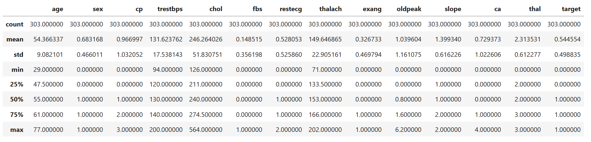

---

### 🔹 Fig. 2.1 — Feature Importance by Mutual Information
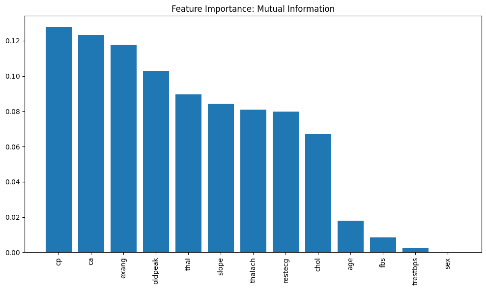

---

### 🔹 Fig. 2.2 — Feature Importance by F-test Scores
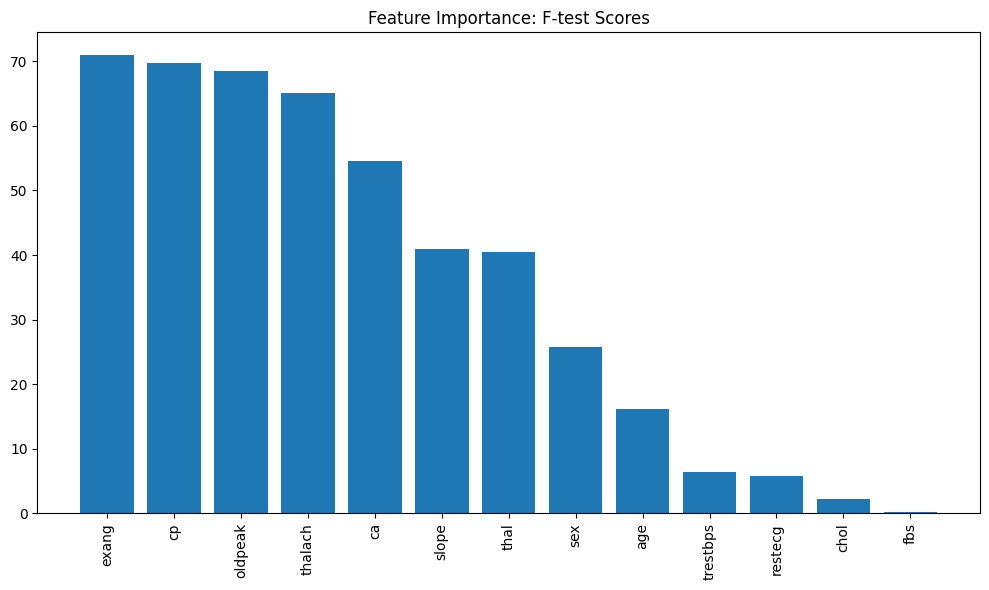

---

### 🔹 Fig. 2.3 — Feature Importance by Correlation
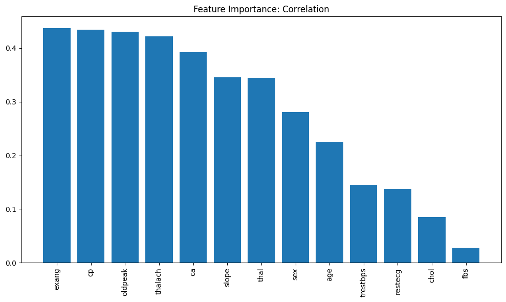

---

### 🔹 Fig. 2.4 — Scaled Feature Importance Comparison
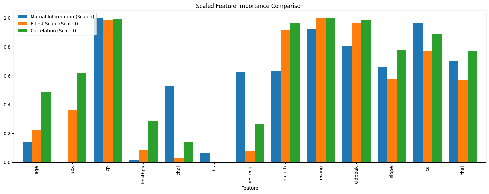

---

### 🔹 Fig. 3 — Top Feature Loadings in First Principal Component
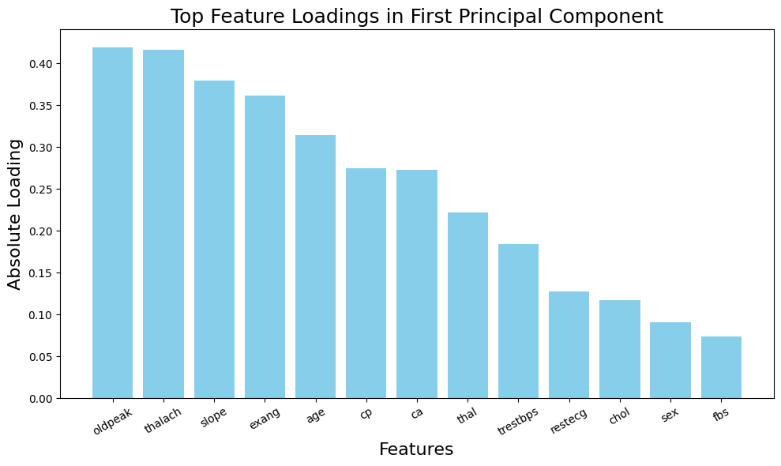

---

### 🔹 Fig. 4 — Feature Importance using Embedded Methods
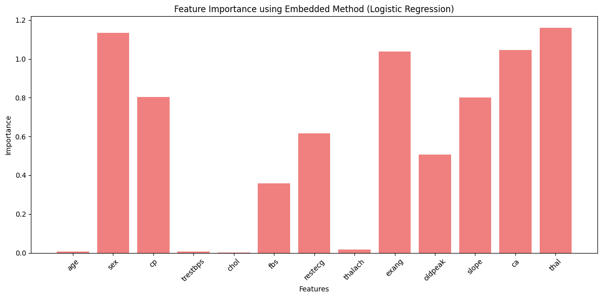

---

### 🔹 Fig. 5 — Comparison of Model K-Fold Accuracies
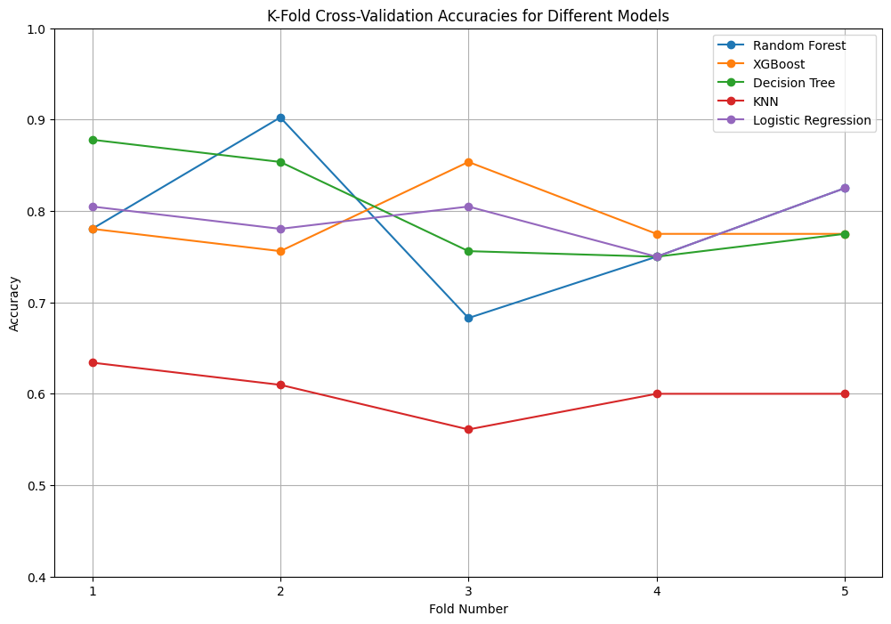

---

### 🔹 Fig. 6 — Comparison of Models Average Accuracies
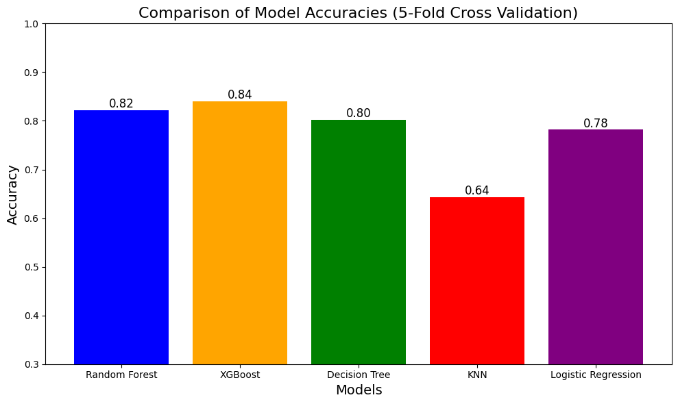

---

### 🔹 Fig. 7.1 — XGBoost with Optimization Techniques
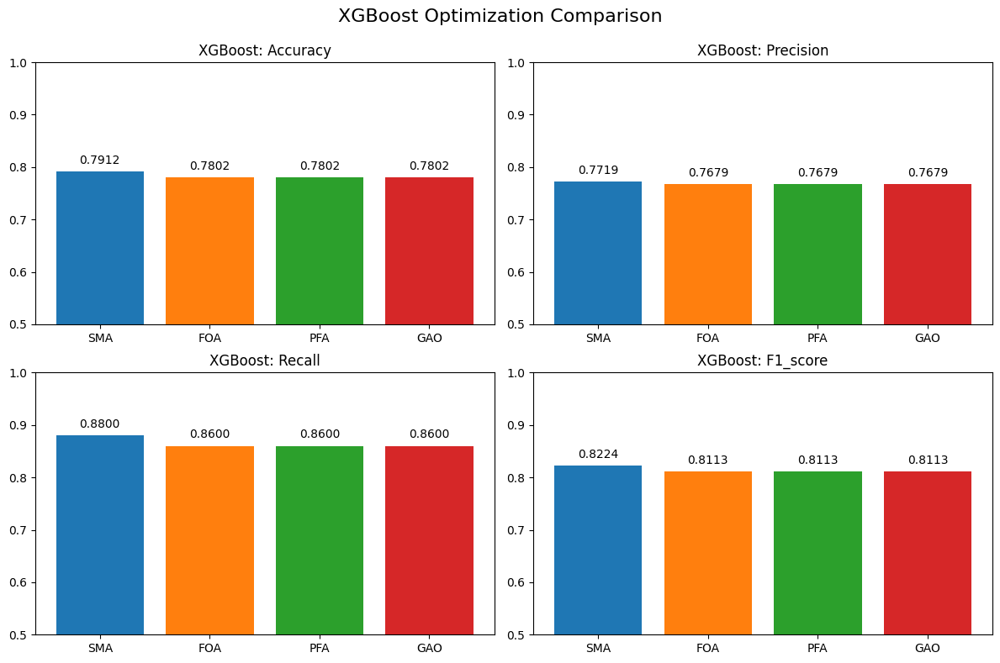

---

### 🔹 Fig. 7.2 — ROC Curve: XGBoost with All Optimizers
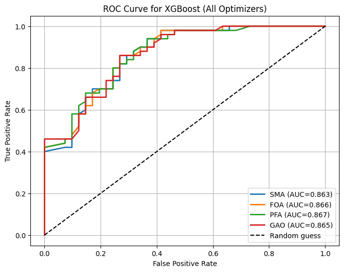

---

### 🔹 Fig. 8.1 — DTC with Optimization Techniques
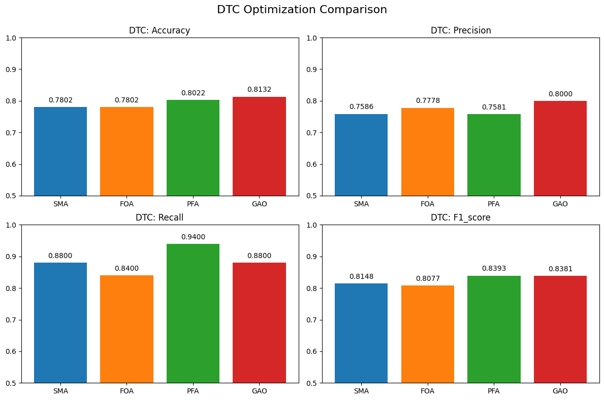

---

### 🔹 Fig. 8.2 — ROC Curve: DTC with All Optimizers
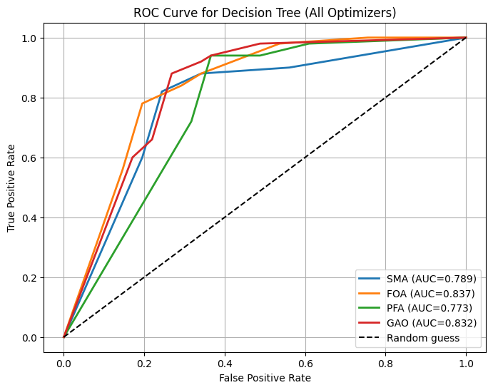

---

### 🔹 Fig. 9.1 — RFC with Optimization Techniques
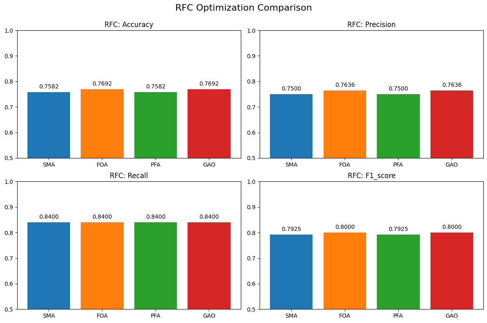

---

### 🔹 Fig. 9.2 — ROC Curve: RFC with All Optimizers
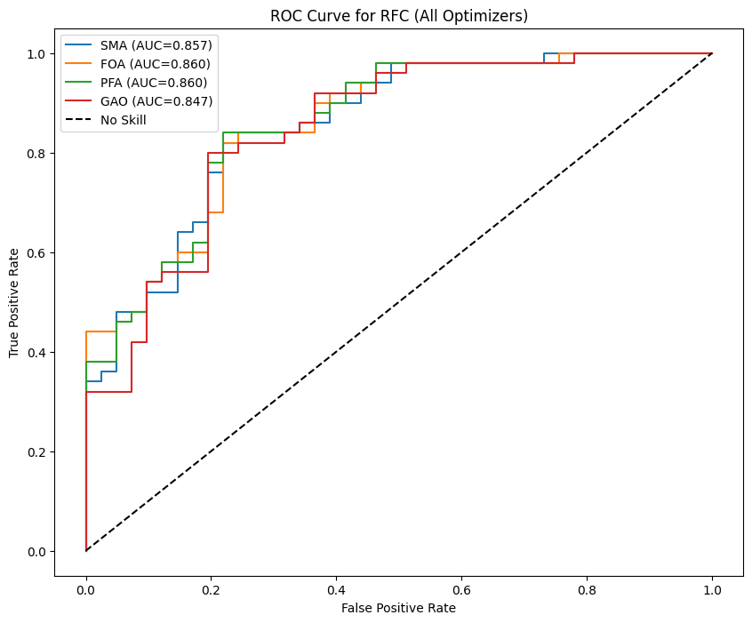

---
